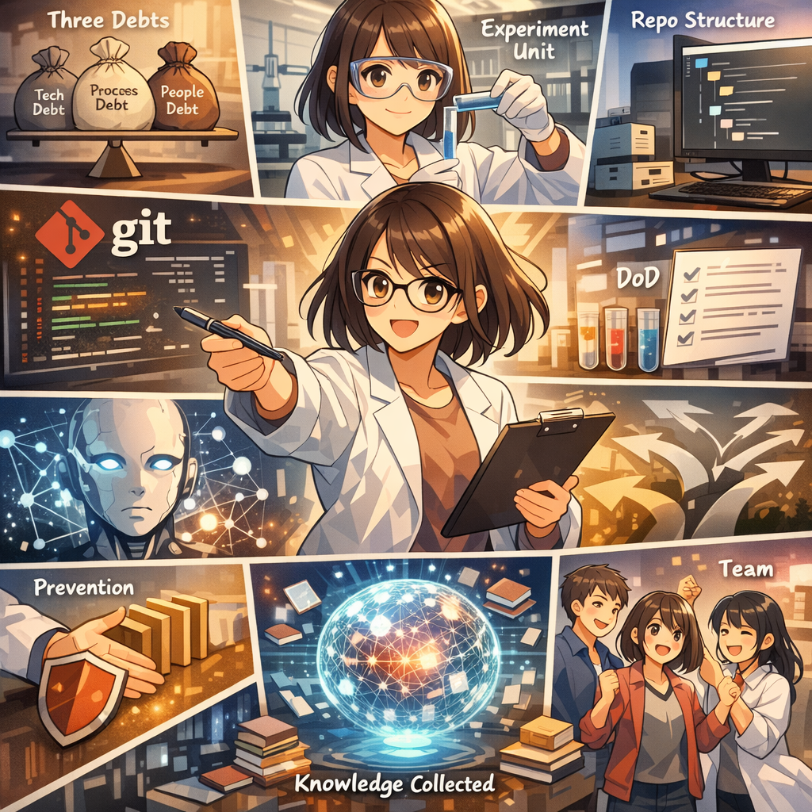

# 终章：新的开始

**论文提交成功**

### 第1格

*小研点击提交按钮的瞬间*

---

### 第2格

*提交成功！确认邮件到达*

---

### 第3格

*庆祝：不是疲惫而是满足*

---

### 第4格

*回顾：从序章的恐慌到现在*

---

### 第5格

*学到的一切：快闪回顾*

---

### 第6格

*感谢：Research Engineering OS这本书*

---

### 第7格

*变化：从reactive到proactive*

---

### 第8格

*新身份：可靠的研究者*

---

### 第9格

*新来的同学来问问题*

---

### 第10格

*小研开始指导新人*

---

### 第11格

*递出自己的Research Engineering OS*

---

### 第12格

*新人眼中的希望*

---

### 第13格

*核心信息：好习惯是最好的投资*

---

### 第14格

*邀请：你也可以成为小研*

---

### 第15格

*结尾：新的一天开始*

---
