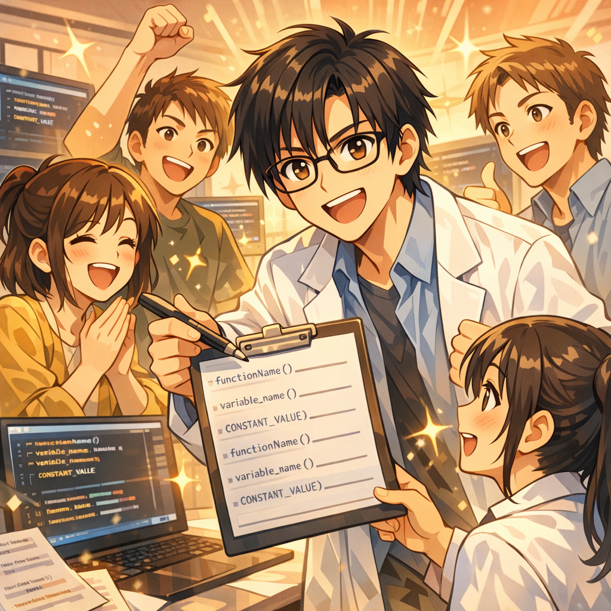

# Version for Students/Collaborators: Minimal Team Standards

## Story Setup: From “Fighting Alone” to “Dragging Each Other Down”

Your research team has three people: you (a PhD student), a junior master’s student, and an undergraduate intern. You are working on the same project and should be collaborating.

**But reality looks like this:**

### Monday Morning Stand-up

You: “I ran a new model over the weekend. The results look good—95% accuracy.”

Junior: “Great! Can you send me the code? I want to keep improving it based on that.”

You: “Uh... the code is on my computer and it’s kind of messy. I’ll organize it and send it to you.” (In fact, you have no idea where to start organizing.)

Intern: “Did you use the data preprocessing I did last week?”

You and the junior: “Uh... which version did you use?”

Intern: “The link I posted in the group chat...” (All three scroll through the chat history and can’t find it.)

Advisor: “What exactly are you three doing? Why are the numbers each of you reports different?”

#### Wednesday Code Conflicts


Junior: “Senior, I pushed the code. Pull it.”

You pull the code and get:

    CONFLICT (content): Merge conflict in src/model.py
    CONFLICT (content): Merge conflict in configs/default.yaml
    CONFLICT (content): Merge conflict in train.py

You open the code and see that the junior modified almost every file. And many changes are incomprehensible to you—he added a bunch of new parameters without any comments.

You spend two hours resolving conflicts, only to discover in the end: your code was overwritten, and last week’s good results can no longer be reproduced.

#### Friday Data Disaster


Intern: “Senior, I accidentally deleted the data/ directory. Do you have a backup?”

You: “What?! That directory is 20GB—data I spent three days processing!”

Intern: “I thought it was temporary... Git wasn’t tracking it...”

Neither you nor the junior has a complete backup. You have to re-download the raw data and rerun three days of preprocessing.

**A week passes. Not only has the project made no progress—it has actually regressed.**

## Why “Individually Strong” Does Not Equal “Team Efficient”

The counterintuitive part of teamwork is this: **each individual may be highly capable, yet the team’s output is very low**.

### Three Major Collaboration Traps

#### Trap 1: Dependence on Tacit Knowledge

Everyone carries a lot of information in their head that “only they know”:

- Why this parameter is set to this value  
- Why this code is written this way  
- Why this experiment failed  
- Why this dataset must be processed in this manner  

When collaboration is required, this tacit knowledge becomes a bottleneck—others can only “wait until you have time to explain,” while you are interrupted repeatedly.

#### Trap 2: Duplicated Work


Without clear division of labor and interfaces, you end up with:

- Two people writing functionally identical code with different implementations  
- Two people processing the same data in different ways  
- Two people running the same experiment but recording it differently  

On the surface it looks like “parallel work,” but in reality it is “wasted compute and time.”

#### Trap 3: Exploding Integration Costs


Everyone “does well” on their own branch, but when merging you find:

- Incompatible interfaces  
- Dependency version conflicts  
- Inconsistent configuration methods  
- Inconsistent evaluation criteria  

In the end, the time spent on “merging and alignment” exceeds the time spent on development.

### Root Cause: Lack of “Team Standards”

A personal project can be “anything goes”—after all, only you need to understand it.

But a team project requires **explicit standards**:

- How code should be written  
- How experiments should be recorded  
- How changes should be merged  
- How issues should be communicated  

**No standards = everyone uses their own approach = collaboration becomes impossible.**

## Minimal Standard 1: Coding Standards (From Chaos to Readability)

### Naming Conventions: Make Code Self-Explanatory



#### File Naming

    # ❌ Bad naming
    test.py
    new.py
    model2.py
    train_final.py

    # ✅ Clear naming
    train_baseline.py              # Train the baseline model
    train_with_attention.py        # Train the model with attention
    evaluate_on_testset.py         # Evaluate on the test set
    preprocess_raw_data.py         # Preprocess raw data

#### Variable and Function Naming

    # ❌ Bad naming
    def f(x, y):
        z = x + y
        return z

    # ✅ Clear naming
    def compute_weighted_loss(prediction, target, weight):
        """
        Compute weighted loss

        Args:
            prediction: Model predictions (batch_size, num_classes)
            target: Ground-truth labels (batch_size,)
            weight: Class weights (num_classes,)

        Returns:
            loss: Weighted cross-entropy loss
        """
        raw_loss = cross_entropy(prediction, target)
        weighted_loss = raw_loss * weight[target]
        return weighted_loss.mean()

**Naming principles:**

- Use full words; avoid abbreviations (unless they are widely accepted, such as num, max, avg)  
- Start function names with verbs (compute, load, save, train, evaluate)  
- Use nouns for variable names (model, dataset, config, metrics)  
- Prefix boolean variables with is/has/should (is_training, has_attention, should_save)  

### Commenting Standards: Written for Future You and Your Teammates

#### Places That Must Be Commented

1.  **Function docstrings** (every function must have one)

          def train_one_epoch(model, dataloader, optimizer, device):
              """
              Train for one epoch

              Args:
                  model: PyTorch model
                  dataloader: Training data loader
                  optimizer: Optimizer
                  device: Device ('cuda' or 'cpu')

Returns:
                  avg_loss: Average loss
                  accuracy: Training accuracy
              """
              ...

2.  **Non-obvious logic**

          # Apply temperature scaling to attention weights to prevent softmax saturation
          attention_scores = attention_scores / temperature

          # Use gradient clipping to prevent exploding gradients
          # The threshold is set to 1.0 based on preliminary experiments
          torch.nn.utils.clip_grad_norm_(model.parameters(), max_norm=1.0)

3.  **Known issues and TODOs**

          # TODO: The implementation here is inefficient and needs optimization
          # Currently O(n^2) complexity; it will be slow when the dataset is large

          # FIXME: Crashes when batch size = 1
          # Temporary workaround: check at the outer level and skip

          # NOTE: This hyperparameter has a large impact on the results
          # Be sure to test on a small dataset before making changes

#### Where you should not add comments

    # ❌ Do not comment on the obvious
    x = x + 1  # Add 1 to x

    # ❌ Do not use comments to "explain bad code"; refactor instead
    # This function is complex, does many things—read it slowly...
    def complicated_function():
        ...

    # ✅ Refactor into clear functions
    def load_data():
        ...

    def preprocess_data(data):
        ...

    def train_model(data):
        ...

### PR template: use it even when working alone


A Pull Request (or Merge Request) template forces you to answer key questions before merging.

#### Create a PR template
    # .github/pull_request_template.md

    ## Summary of changes
    [Describe in one sentence what this PR does]

    ## Type of change
- [ ] New feature (feature)
- [ ] Bug fix (fix)
- [ ] Refactor (refactor)
- [ ] Documentation (docs)
- [ ] Test (test)

    ## Details
    [Explain in detail what changed and why]

    ## How to verify
    ```bash
    # Provide verification steps
    make test
    python train.py --config configs/test.yaml
    ```

    ## Potential risks
    [What issues might this change introduce?]

    ## Related experiments
- Run ID: [If relevant, provide run_id]
- Results comparison: [Metric comparison between the new/old implementations]

    ## Checklist
- [ ] Code passes lint checks
- [ ] Necessary tests added
- [ ] Relevant documentation updated
- [ ] All tests pass
- [ ] Changes do not break existing functionality (regression testing)

**Why "use it even when working alone"?**

- Forces you to think about "what exactly does this change do?"

- Leaves a clear record for future teammates (or future you)

- Once it becomes a habit, team collaboration naturally becomes standardized

## Minimal standard 2: Experiment standards (from verbal to auditable)

### Standardize run_id naming

**Problem:** Everyone names experiments differently, causing confusion.

**Solution:** The team standardizes a run_id format.

    # Team-wide standard format
    YYYY-MM-DD_HHMM_<person>_<experiment>

    For example:
    2026-02-15_1030_zhangsan_baseline
    2026-02-15_1400_lisi_attention_ablation
    2026-02-16_0900_wangwu_data_augmentation

Benefits:

- Sortable by time

- You know whose experiment it is (so you know who to ask when something goes wrong)

- You know what the experiment is about

### Standardize config management

**Problem:** Everyone uses different config formats, making comparisons impossible.

**Solution:** The team shares a single base config; individuals write only the differences.

    configs/
      base.yaml              # Team baseline configuration
      people/
        zhangsan_*.yaml      # Zhangsan's personal experiment configs
        lisi_*.yaml          # Lisi's personal experiment configs
      paper/                 # "Official" configs related to the paper
        baseline.yaml
        main_method.yaml
        ablation_*.yaml

#### base.yaml example

    # configs/base.yaml
    # Team baseline configuration; do not modify casually
    # If changes are necessary, they must be discussed in a team meeting

    model:
      type: "transformer"
      hidden_dim: 512
      num_layers: 6

    data:
      path: "/data/shared/project_data_v3"
      batch_size: 32
      num_workers: 4

    training:
      epochs: 100
      learning_rate: 3e-4
      optimizer: "adam"

    evaluation:
      metric: "accuracy"
      eval_every: 1000

#### Personal config example

    # configs/people/zhangsan_attention_test.yaml

    # Inherit the baseline configuration
    base: ../base.yaml

    # Specify only the differences
    model:
      attention_type: "multi_head"  # Change point
      num_heads: 8                  # New parameter added

# Tagging Experiment Metadata
    experiment:
      owner: "Zhang San"
      hypothesis: "Multi-head attention can improve accuracy by 2–3%"
      related_runs:
        - "2026-02-15_1030_zhangsan_baseline"

## Standardize the logging format

**Problem:** Everyone records experiments differently, making it impossible to aggregate and compare.

**Solution:** Use standardized run.json and run.md templates (see Chapter 6).

**Team conventions:**

1. Within 10 minutes after each experiment finishes, you must:
       - Generate run.json (automatic)
       - Fill in run.md (manually, 5 lines)

2. Required fields in run.md:
       - Hypothesis: what this experiment aims to validate
       - Change: what was changed compared to what
       - Conclusion: what the result is (one sentence)
       - Next step: what to do next based on the result
       - @ Advisor: whether advisor attention is needed

3. If you forget to record:
       - You will be reminded at the group meeting that week
       - If you forget twice consecutively: you must backfill all missing records

## Minimum Standard 3: Communication Norms (from verbal to traceable)

### Weekly meeting norm: only review reproducible runs

**Problem:** Weekly group meetings turn into a “verbal reporting contest”—claims sound impressive but lack evidence.

**Solution:** Discuss only experiments with a run_id.

#### Weekly meeting template

    # Weekly Group Meeting (30–45 minutes)

    ## 1. Round-robin updates (5–10 minutes per person)

    Format：
- Experiments completed this week: [list run_id]
- Key findings: [based on experimental data, not speculation]
- Issues encountered: [specific issues, not “not great”]
- Plan for next week: [specific goals, not “keep tuning hyperparameters”]

    ❌ Unacceptable updates:
- "I think this method should work" (no experimental support)
- "I ran many experiments" (without listing run_id)
- "The results are okay" (without concrete metrics)

    ✅ Good example:
    "I ran three experiments:
     - 2026-02-15_1030_zhangsan_baseline: 92.0%
     - 2026-02-15_1400_zhangsan_attention: 93.5% (+1.5%)
     - 2026-02-16_0900_zhangsan_attention_v2: 93.2% (+1.2%)
    Conclusion: the attention mechanism is effective, but the improvements introduced in v2 instead reduced performance.
    Plan for next week: investigate why v2 is worse and try to fix it."

    ## 2. Team decisions (10 minutes)

- Which experiments should be merged into the mainline?
- Which directions should be abandoned?
- Who is responsible for what next week?

    ## 3. Debt check (5 minutes)

- Check whether last week’s TODOs are completed
- Check whether there are unlogged experiments
- Check whether there is conflicting code that needs to be merged

    ## 4. Next-week assignments (5 minutes)

    Clarify each person’s tasks and deliverables:
- Zhang San: complete ablation experiments (estimated 3 runs)
- Li Si: improve data augmentation (estimated 2 runs)
- Wang Wu: organize scripts for paper figures and tables

### Asynchronous communication norm: use documents rather than verbal exchanges

**Problem:** Teammates interrupt you at inappropriate times to ask questions.

**Solution:** Build a culture of “read the docs first, then ask people.”

#### Team documentation structure

    docs/
      README.md              # Project overview
      SETUP.md               # Environment setup guide
      WORKFLOW.md            # Workflow
      FAQ.md                 # Frequently asked questions
      EXPERIMENTS.md         # Experiment tracking
      DECISIONS.md           # Record of important decisions
      CONTACTS.md            # Who owns what

#### FAQ.md example

    # Frequently Asked Questions

    ## Q: How do I set up the environment?
    See SETUP.md

    ## Q: Where is the data stored?
    `/data/shared/project_data_v3`
    Do not modify this directory; it is read-only.

    ## Q: How do I submit code?
1. Create a branch: git checkout -b exp/your-name-feature
2. Complete changes and test
3. Submit a PR (use the template)
4. Wait for review
5. Delete the branch after merging

    ## Q: What should I do if an experiment crashes?
1. Check outputs/<run_id>/error.log
2. Search the FAQ to see whether there is a similar issue
3. If you cannot find an answer, ask in an issue (do not message directly on WeChat)

    ## Q: How do I reproduce someone else’s experiment?
    make reproduce RUN=<run_id>

    ## Q: Can I modify base.yaml?
    No. It can be changed only after discussion in a team meeting.
    For temporary testing, you may create your own config.

    ## Q: My experimental results differ from someone else’s—what should I do?
1. Check whether you used the same config
2. Check whether you used the same data version
3. Check whether you used the same random seed
4. Discuss at the weekly meeting

### Issue tracking: make problems and tasks searchable

**Problem:** People discuss issues in the WeChat group, and three days later no one can find them.

**Solution:** Important issues must be filed as an issue (GitHub/GitLab/Jira).

#### Issue template

    # Bug Report
    **Problem description**: [briefly describe the issue]

    **Steps to reproduce**:
1. Run the command: `python train.py --config ...`
2. Observe: [screenshots or logs]

    **Expected behavior**: [what should happen]

    **Actual behavior**: [what actually happens]

    **Environment information**:
- Branch: [branch name]
- Commit: [commit hash]
- Python: [version]
- CUDA: [version]

    **Related run_id**: [if any]

---

    # Feature Request
    **Request description**: [what functionality you want]

    **Use case**: [why it is needed]

    **Proposed implementation**: [optional]

---

    # Task
    **Task description**: [what needs to be done]

    **Acceptance criteria**: [what counts as done]

    **Owner**: [@someone]

    **Due date**: [YYYY-MM-DD]

    **Dependencies**: [does it depend on other tasks?]

## Advisor’s perspective: how to help students build good habits

### Day 1: Set expectations

**Do not assume students will “naturally do it right.”** You must explicitly communicate your expectations.

#### Onboarding checklist

    # New Member Onboarding Checklist

## Day 1 (Environment Setup)
- [ ] Set up the development environment (see SETUP.md)
- [ ] Obtain access to the code repository
- [ ] Obtain server access
- [ ] Obtain access to shared data
- [ ] Read README, WORKFLOW, FAQ

## Week 1 (Familiarizing Yourself with the Workflow)
- [ ] Reproduce an existing experiment (verify the environment setup is correct)
- [ ] Run a small experiment (verify your understanding of the workflow)
- [ ] Record experiments comprehensively (run.json + run.md)
- [ ] Submit your first PR (even if it is very small)

## Month 1 (Working Independently)
- [ ] Independently complete one exploratory direction
- [ ] Proactively identify and solve problems
- [ ] Be able to help onboard new members

### Regular Reviews: Focus Not Only on Results, but Also on Process

**Do not only ask “How are the results?” in weekly meetings; check “Is the process standardized?”**

#### Weekly Code Review Checklist


    Checklist:
- [ ] Are all experiments from this week fully documented?
- [ ] Does the run_id follow the naming convention?
- [ ] Have the config files been updated?
- [ ] Are commit messages clear?
- [ ] Are there improvements that should be merged?
- [ ] Is there any technical debt that needs to be addressed?

If issues are found, point them out immediately and require corrections. **Do not say “Don’t do it again,” otherwise bad habits will become entrenched.**

### Reward Good Habits

**Explicitly praise** what was done well:

- "Your experiment records this week are very clear; I can understand them at a glance."

- "Your PR description is very detailed; the review went smoothly."

- "You proactively supplemented the documentation, which helped everyone."

**Make good habits part of the team culture.**

## From a Student’s Perspective: How to Survive in a Chaotic Project

### If the Project Is Already Very Chaotic

**You may encounter:**

- Your advisor’s code has no documentation
- A senior student’s code does not run
- No one knows where the data is stored
- No one knows how a certain experiment was run

**Survival strategies:**

#### Strategy 1: Create a “Clean Zone” for Yourself

    # Create your own subproject within a chaotic project

    my_workspace/
      src/           # Your code (independent of the chaotic parts)
      configs/       # Your configurations
      outputs/       # Your experiment records
      docs/          # Your documentation
      README.md      # Description of your work

Even if the overall project is messy, at least your part is clear.

#### Strategy 2: Write Down Your Understanding

    # docs/MY_UNDERSTANDING.md

    ## Project Goals
    [What I understand the project goals to be]

    ## Existing Code
    [Key files I found and their roles]

    ## Known Issues
    [Issues I encountered and temporary workarounds]

    ## My Work
    [What I am responsible for and my progress]

This document:

- Helps you clarify your thinking
- Provides a record for future handoffs
- Enables you to align understanding with your advisor

#### Strategy 3: Proactively Establish Standards

Even if the team has no standards, you can **establish standards for yourself**:

- All your experiments have a run_id and documentation
- Your code has clear comments
- All your commits have descriptions

Good habits will be noticed and may influence the team.

### How to Ask for Help

**❌ A poor way to ask for help:**

"Senior, my code won’t run—can you take a look?" (no context at all)

**✅ A good way to ask for help:**

    Senior, I ran into an issue while reproducing the baseline experiment. Could you help take a look?

    **Issue**: It crashes at epoch 10 with the error CUDA out of memory

    **My setup**:
- Branch: main
- Commit: a1b2c3d
- Config: configs/baseline.yaml
- GPU: V100 16GB

    **What I tried**:
1. Reduce batch size to 16 (still crashes)
2. Reduce model hidden_dim to 256 (it runs, but the results are incorrect)

    **Logs**: see attached error.log

    **Question**: Are there other configurations that need adjustment, or do I need a larger GPU?

Clear help requests receive faster and more useful responses.

## Conflict Resolution: Common Team Issues

### Issue 1: Inconsistent Code Style

**Solution:** Enforce consistency with automated tools.

```bash
# Install formatter and linter
pip install black flake8 isort

# .pre-commit-config.yaml
repos:
  - repo: https://github.com/psf/black
    rev: 23.1.0
    hooks:
      - id: black

  - repo: https://github.com/PyCQA/flake8
    rev: 6.0.0
    hooks:
      - id: flake8

# Install the pre-commit hook
pre-commit install

# Now formatting will run automatically before each commit
```

## Issue 2: Experimental Results Do Not Match

**Troubleshooting checklist:**

1. [ ] Same code version? (commit hash)
2. [ ] Same configuration? (config diff)
3. [ ] Same data? (data hash)
4. [ ] Same random seed? (seed)
5. [ ] Same environment? (Python/CUDA versions)
6. [ ] Same evaluation script? (eval script)

Check item by item; you will always find the cause.

### Issue 3: Unclear Responsibilities Lead to Duplicate Work
**Solution:** Use a Kanban board to visualize tasks.

    # You can use GitHub Projects or Trello

    Board columns:
- To Do (TODO)
- In Progress (In Progress)
- Waiting for Review (Review)
- Done (Done)

    Each task card:
- Title: [brief description]
- Owner: [@someone]
- Due date: [date]
- Dependencies: [dependent tasks]
- Status: [current progress]

Everyone can see “who is doing what,” avoiding duplication.

### Issue 4: Misaligned Expectations Between Advisor and Student

**Solution:** Write expectations down explicitly and realign regularly.

    # docs/EXPECTATIONS.md

    ## Advisor Expectations
- At least 3 documented experiments per week
- All code passes linting and tests
- Attend weekly meetings on time and report progress
- Report issues within 24 hours

    ## Student Expectations
- One 1-on-1 Q&A session per week
- Key decisions discussed in advance
- Code reviews completed within 48 hours
- Requirements stabilized one month before the paper deadline

## Mutual Commitments
- Communicate honestly and do not conceal problems
- Respect each other’s time
- Share responsibility for the project’s success

Making expectations explicit can prevent many latent conflicts.

## 10-Minute Action: Establish the Team’s First Standard

If you do only one thing right now: establish the team’s first minimal standard.

1. **If you are a mentor/project lead** (10 minutes)

```sh
# Create the team standards document
mkdir docs
cat > docs/TEAM_RULES.md <<EOF
# Minimal Team Standards

## Experiment Logging Standards
- Every experiment must have a run_id: YYYY-MM-DD_HHMM_name_experiment
- Every experiment must have run.json (automatic) and run.md (manual, 5 lines)

## Code Commit Standards
- Commit message format: <type>: <description>
  - type: feat | fix | refactor | docs | test
- Run make test before committing

## Weekly Meeting Standards
- Fixed time: every Monday at 10:00
- Must prepare in advance: list run_id and key findings
- Discuss only content supported by experimental evidence

## Communication Standards
- Open a GitHub issue for important matters (do not discuss only on WeChat)
- Urgent matters may be handled on WeChat, but file an issue afterward

## Effective Date
Effective starting next Monday.
EOF

# Announce and discuss at the next group meeting
```

2. **If you are a student/team member** (10 minutes)

```sh
# Establish a personal working standard

cat > MY_WORKFLOW.md <<EOF
# My Workflow

## After each experiment (5 minutes)
- [ ] Generate run.json
- [ ] Fill in the five elements in run.md
- [ ] Commit relevant code changes

## Every Friday (15 minutes)
- [ ] Organize the list of this week’s experiments
- [ ] Prepare materials for the weekly meeting report
- [ ] Check for any missing records

## Before each code commit (2 minutes)
- [ ] Run make test
- [ ] Write a clear commit message
- [ ] If the change is important, open a PR

## Whenever I encounter a problem
- [ ] Check the FAQ and documentation first
- [ ] If no answer is found, open an issue (describe clearly)
- [ ] After the problem is solved, update the FAQ
EOF

# Start executing from today
```

3. **Proposal for the next team meeting** (prepare a 5-minute statement)

Suggest saying in the meeting:

"I’ve noticed that our team is somewhat chaotic in experiment logging and code management.
I suggest we establish some minimal standards, such as:
- A unified run_id format
- A unified approach to config management
- A weekly check of experiment record completeness

I drafted an initial version (see docs/TEAM_RULES.md),
and everyone can discuss and add to it.

I suggest we pilot it starting next week and evaluate the results after one month."

After completing this 10-minute action, you will find:

- The team has a “starting point”—a starting point for moving from chaos to order
- Everyone has a shared language—knowing what it means to “do it well”
- Subsequent improvements can be iterative—rather than remaining chaotic indefinitely

## Chapter Summary: Standards Are Not Constraints, but the Foundation of Efficient Collaboration

The paradox of teamwork:

- **No standards**: everyone is “free,” but team efficiency is extremely low
- **Over-standardization**: processes become cumbersome and constrain creativity
- **Minimal standards**: just enough—ensuring quality while maintaining flexibility

**Three levels of minimal standards:**

1. **Coding standards**: make code readable, maintainable, and collaborative
2. **Experiment standards**: make experiments traceable, comparable, and reproducible
3. **Communication standards**: make issues searchable, decisions traceable, and responsibilities clear

**Remember:**

- Standards are not “management” tools, but “collaboration” tools
- Standards are not “restrictions,” but “friction reduction”
- Standards are not “one-time setup,” but “continuous improvement”

**Finally:** If your team is chaotic right now, do not be discouraged. Start with a minimal standard and improve step by step. Even if you are the only one to begin, good habits will gradually influence the team.

**High-performing teams are not “born”; they are built by establishing standards and executing them consistently.**