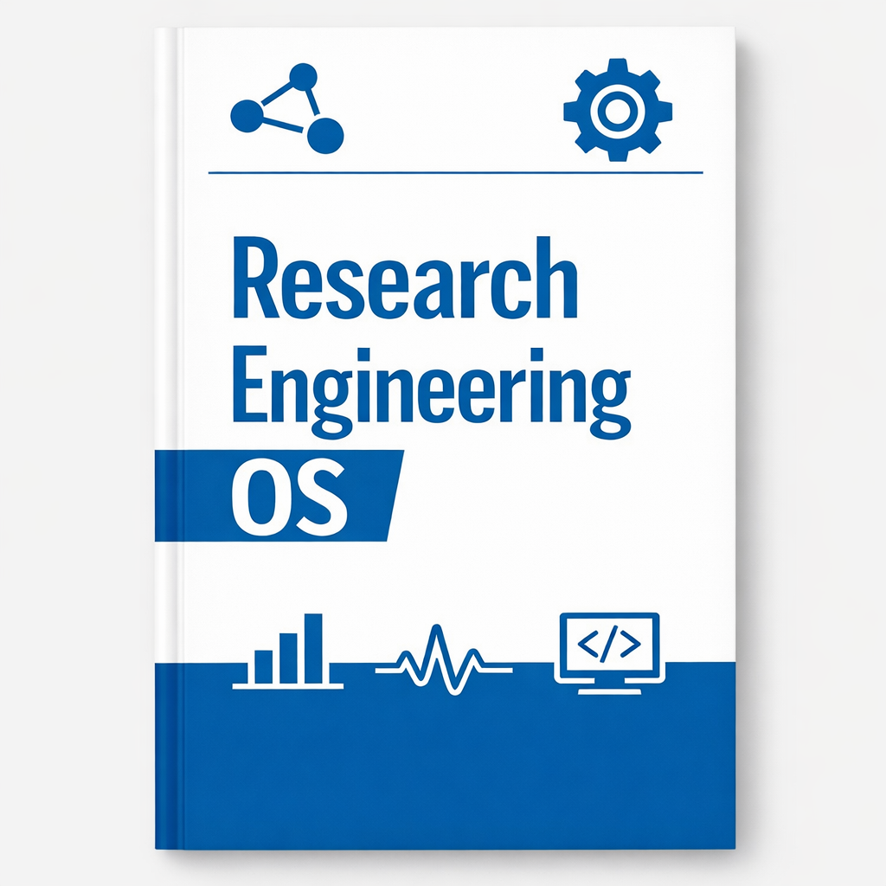

# Research Engineering OS

**「やり直し」を「規範＋テンプレート＋チェックリスト」に凝縮する**

著者：Li Hongmin (李鴻敏)
東京大学 大学院新領域創成科学研究科 計算生物学及び医科学専攻

---

## 本書について

本書は「コードの書き方」を教える本ではなく、**「研究コードをどう管理するか」**を教える本です。

対象読者：
- AI/ML 研究者
- 計算生物学の研究者
- 実験コードを保守する必要があるすべての科学研究者

核心となる理念：
- **実験こそが単位である**（コードファイルではない）
- **探索は自由であっても、出力はクリーンであるべきだ**
- **結論は一時的に脆弱であっても、証拠チェーンは堅牢であるべきだ**

---

## オンラインで読む

本書は完全にオープンソースであり、オンラインで無料で読むことができます。もし役立つと感じたら、ぜひ以下をお願いします：
- ⭐ [GitHub](https://github.com/Li-Hongmin/Research-Engineering-OS-) でスターをつける
- 📖 [紙版/Kindle版](https://kdp.amazon.com) を購入してコレクションする
- 💬 フィードバックや提案を送る

---

## バージョン情報

- **オンライン版**：最新の内容が含まれ、継続的に更新されます。
- **紙版**：v1.0、2026年2月 初版発行。

---

## 読み始める

[前書き](./00-preface.md) から始めるか、以下のトピックに直接ジャンプしてください：
- [なぜいつも最後に失敗するのか](./01-why-flip.md) - 問題の根源を理解する
- [実験こそが単位](./02-experiment-unit.md) - 核心となる考え方
- [リポジトリ構成](./03-repo-layout.md) - 実践ガイド

---

## 連絡先

- **Email**: lihongmin@edu.k.u-tokyo.ac.jp
- **Web**: [li-hongmin.github.io](https://li-hongmin.github.io)

---

© 2026 Li Hongmin. All rights reserved.
