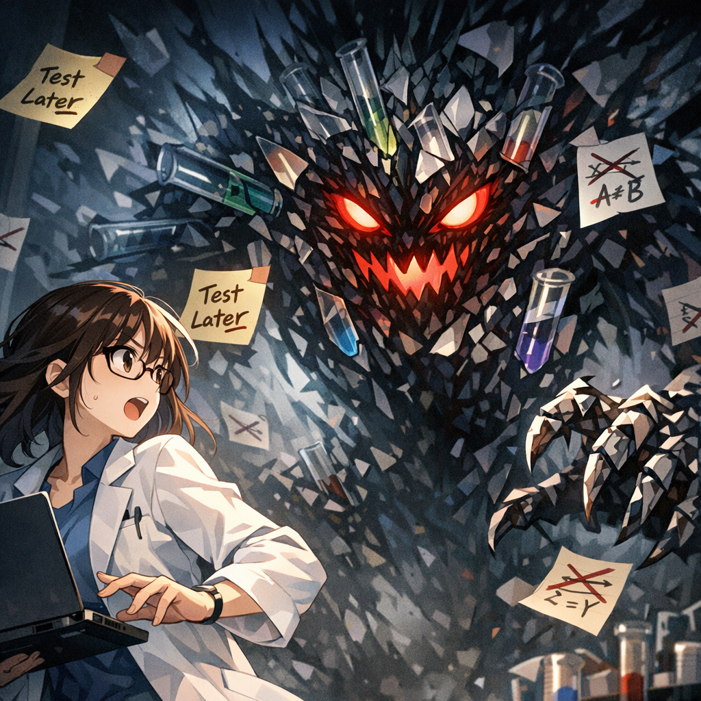

The Shadow of Verification Debt

The second monster appeared: “verification debt.” Compared with the chaos of exploration debt, it felt far more ominous. Its body was made of shattered test tubes and unfinished experiments, and countless sticky notes reading “test later” covered it like scales. When you’re at your most triumphant, it quietly pulls the foundation out from under your success.

---

[← Previous Page](10.md) &nbsp;&nbsp;&nbsp; [Next Page →](12.md)

