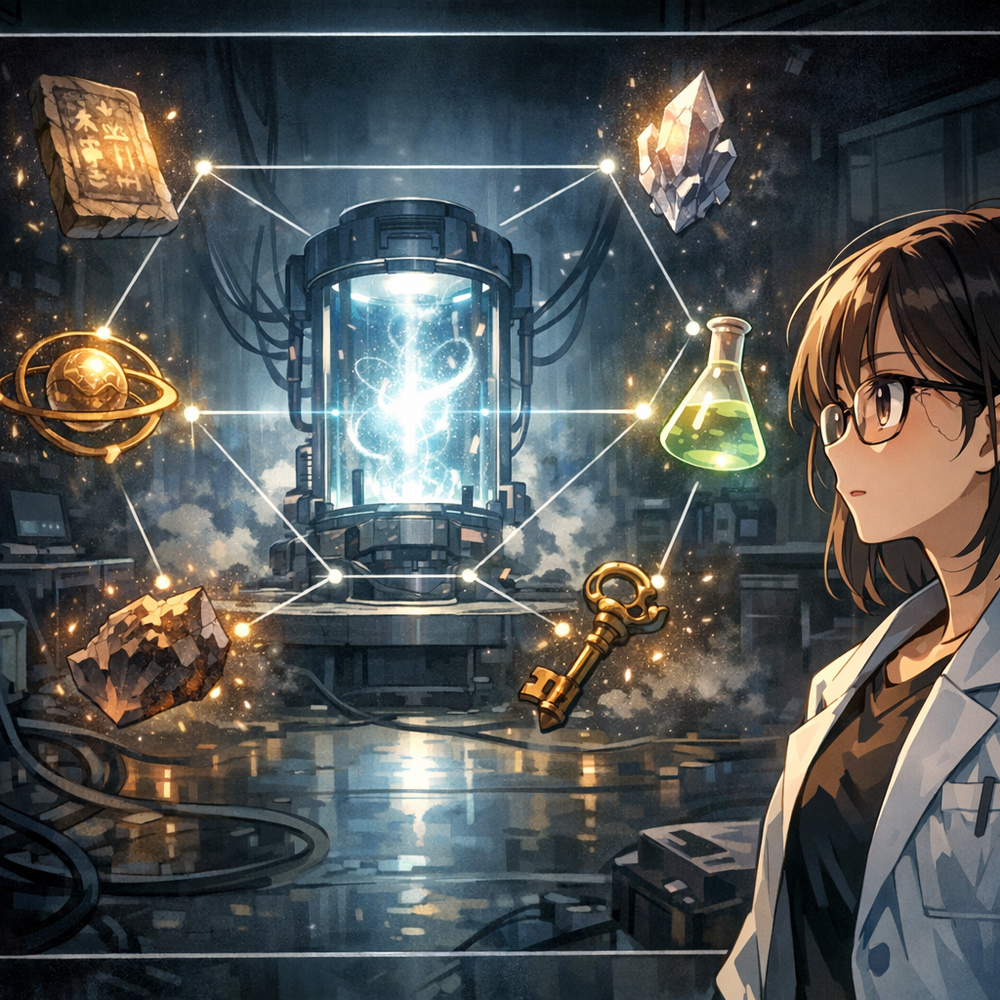

Experiments as Unit Weapons

Outside the window, dawn was just breaking. Xiaoyan turned to the next chapter of the book: “Experiments Are the Unit.” A brand-new weapon was beckoning to her. In this battle, she had only just realized how to win. Ahead, an even broader world of engineering awaited her to explore.

---

[← Previous Page](24.md) &nbsp;&nbsp;&nbsp; [Next Chapter: Chapter 2: Experiment as the Basic Unit →](../02-experiment-unit/01.md)

