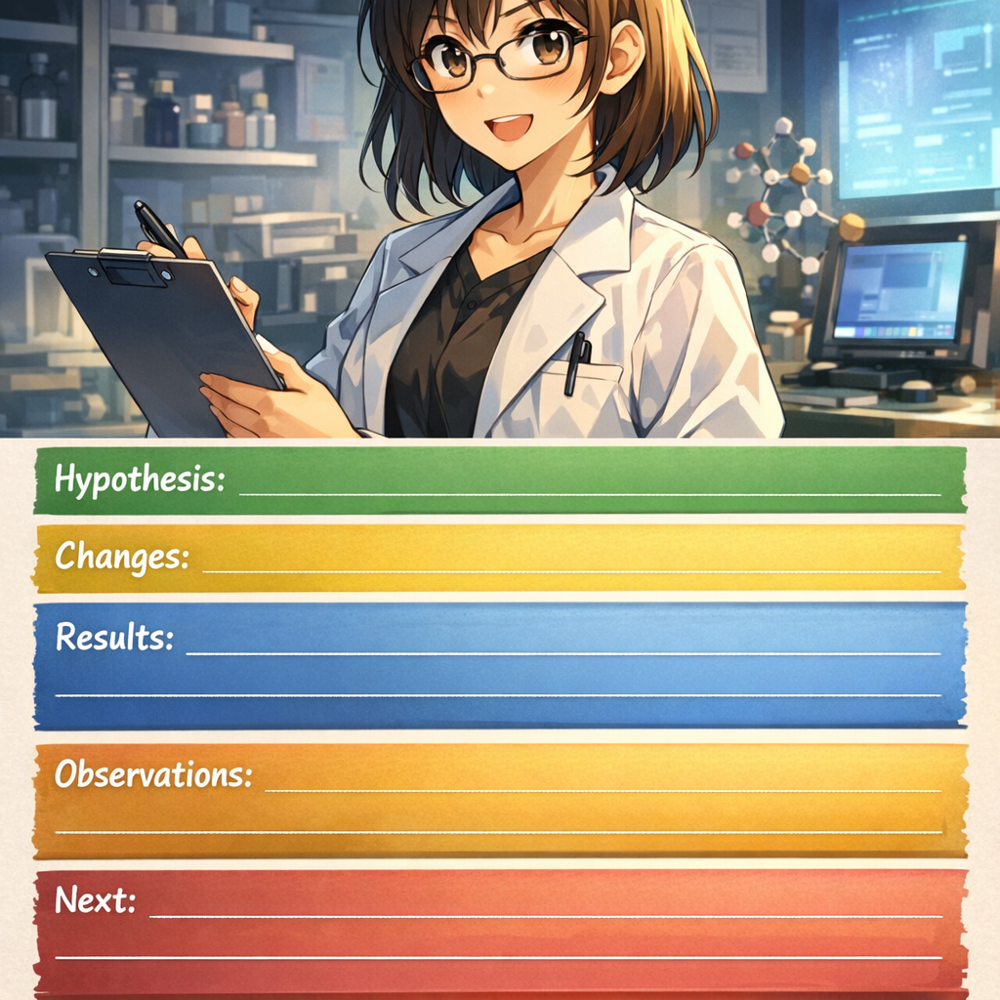

# 第六章：记录的艺术

**日志考古学**

### 第1格

*三个月后，小研试图找回实验细节*

---

### 第2格

*翻找笔记：只有零散片段*

---

### 第3格

*找配置：到底用的哪个？*

---

### 第4格

*领悟：当时的我对未来的我太残忍*

---

### 第5格

*解决方案：双层日志系统*

---

### 第6格

*第一层：自动记录（JSON）*

---

### 第7格

*第二层：人工笔记（Markdown）*

---

### 第8格

*run.json结构：机器的完美记忆*

---

### 第9格

*run.md模板：人类的快速记录*

---

### 第10格

*工作流：实验前中后的记录*

---

### 第11格

*好处1：三个月后立即找到*

---

### 第12格

*好处2：审稿人要数据秒回*

---

### 第13格

*好处3：团队成员能接手*

---

### 第14格

*好处4：写论文素材齐全*

---

### 第15格

*工具：MLflow/W&B集成*

---

### 第16格

*工具：自动化脚本*

---

### 第17格

*实践：5分钟日志习惯*

---

### 第18格

*技巧：记录失败和惊喜*

---

### 第19格

*10分钟行动：为下次实验设置日志*

---

### 第20格

*下一章预告：AI助手的陷阱*

---
