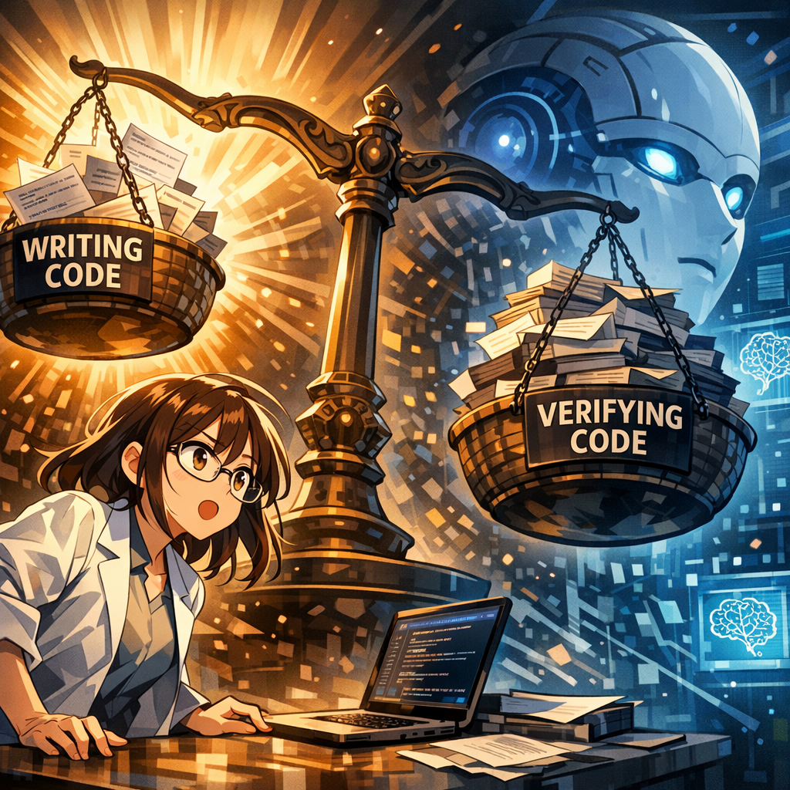

Test-Driven Development

AI can also help refactor code. Xiaoyan tells the AI: 'I have this piece of code and want to improve its performance/readability.' The AI offers suggestions. Xiaoyan evaluates these suggestions, selects the valuable ones, and implements them herself. Humans retain the final decision-making authority; the AI only provides options.

---

[← Previous Page](13.md) &nbsp;&nbsp;&nbsp; [Next Page →](15.md)

