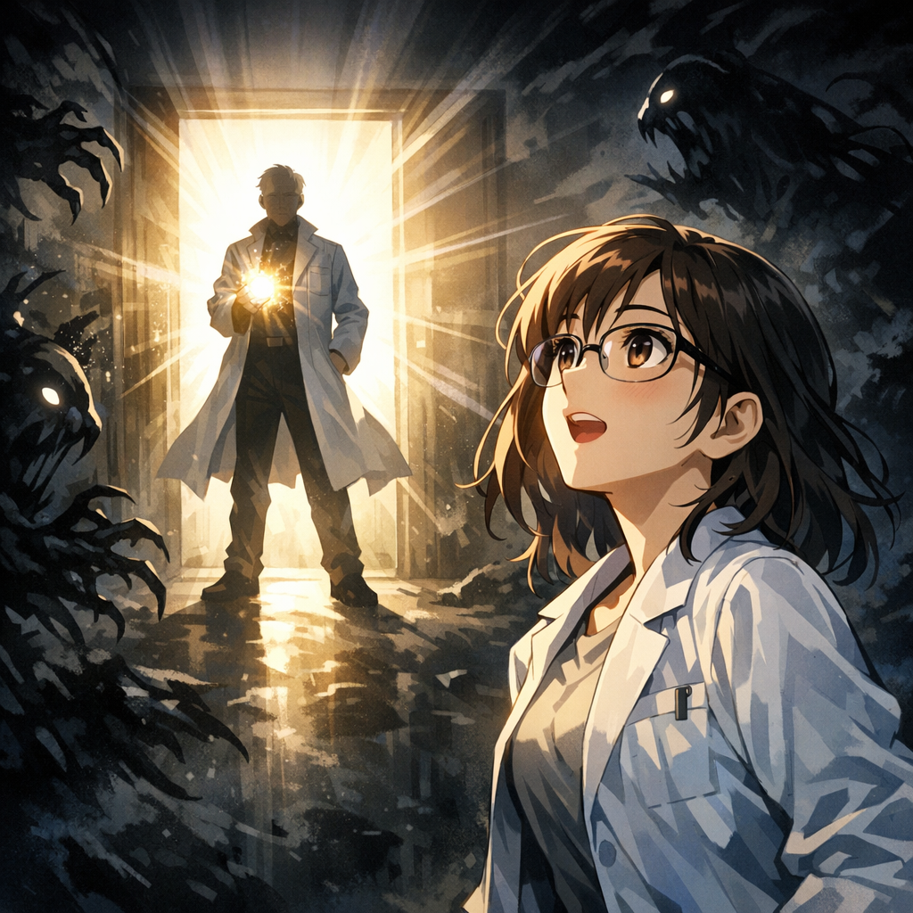

指導教員の救援が現れる

絶望が彼女を飲み込もうとしたその瞬間、実験室の扉がそっと押し開けられた。一筋の光が差し込み、怪物たちは悲鳴を上げながら後ずさった。小研は顔を上げた——扉口に指導教員が立っていて、手には光る本を持っている。指導教員は落ち着いた口調で言った。「君には知っておいてほしいことがある。これらの問題をどうやって体系的に片づけるか、についてだ。」

---

[← 前のページ](10.md) &nbsp;&nbsp;&nbsp; [次のページ →](12.md)

