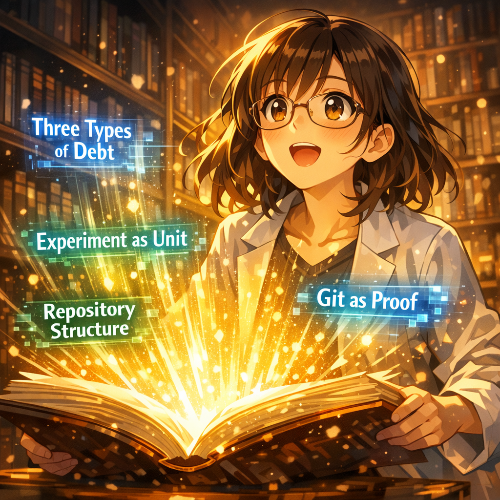

本の中の答え

小研は震える手で本の最初のページを開いた。章のタイトルが金色の光の中で瞬きながら浮かび上がる――「3種類の負債」「単位としての実験」「リポジトリ構造」「Gitによる証明」……どのタイトルも、今の彼女を最も悩ませている問題を突き刺した。彼女は突然気づいた。これはただのエンジニアリング技術ではない。ひとつの完成されたシステムなのだ。

---

[← 前のページ](13.md) &nbsp;&nbsp;&nbsp; [次のページ →](15.md)

