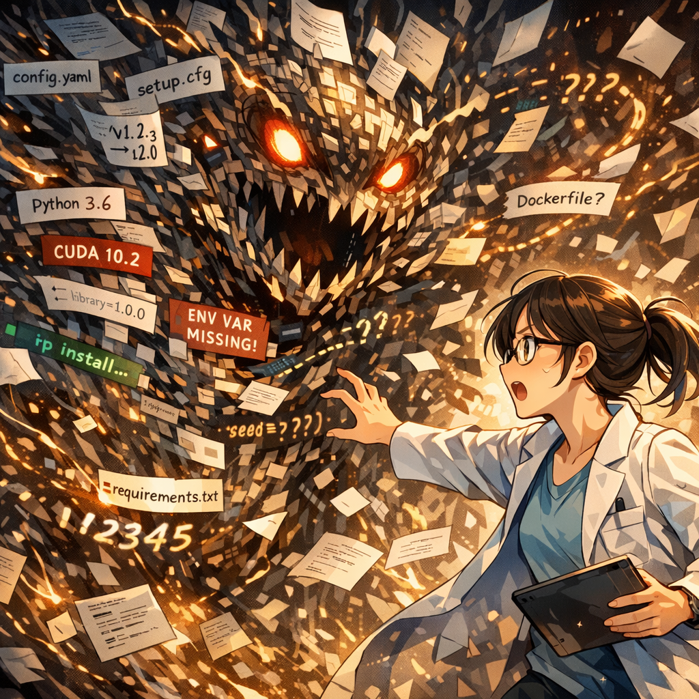

再現負債の灰い霧

最後にして、最も厄介な怪物――『再現負債』が姿を現した。そいつの身体は、断片化した設定ファイル、衝突するバージョン、そして消えた乱数シードでできている。まるで目に見えない灰色の霧のように、「自分のPCでは問題なく動く」というコードの一行一行の周りを覆い尽くしていた。

---

[← 前のページ](15.md) &nbsp;&nbsp;&nbsp; [次のページ →](17.md)

