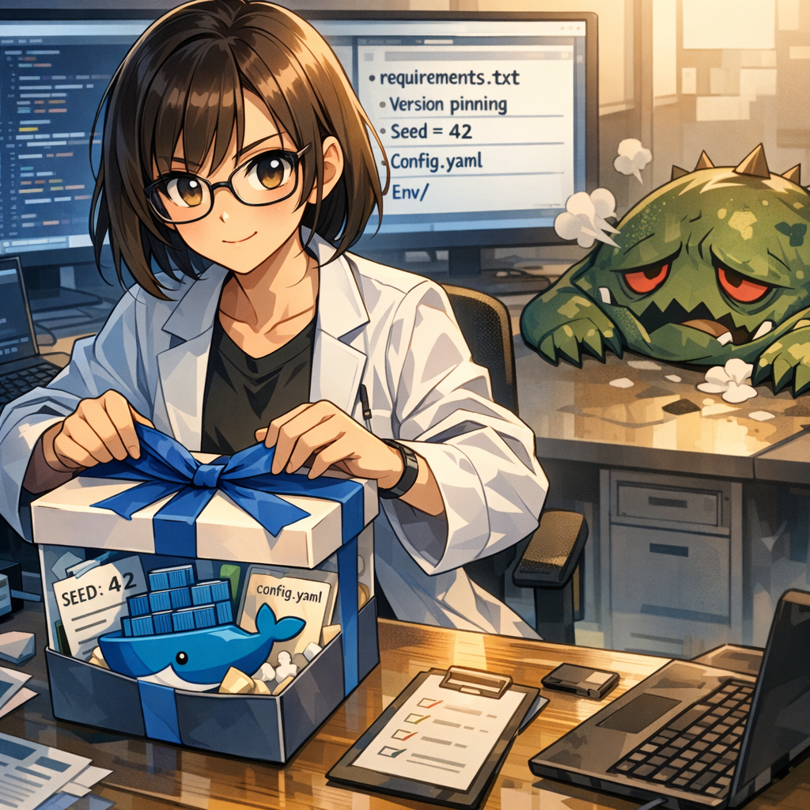

運命共同体の紐づけ

「コードと環境は運命共同体でなければならない。」みなみは歯を食いしばり、環境をパッケージ化する学習を始めた。もはや脆弱な個人の記憶に頼るのではなく、それを設定ファイルに固定化した。Dockerコンテナの封じ込めに成功すると、灰色の霧はついにこの「ルールの光」によって払い散らされた。

---

[← 前のページ](19.md) &nbsp;&nbsp;&nbsp; [次のページ →](21.md)

