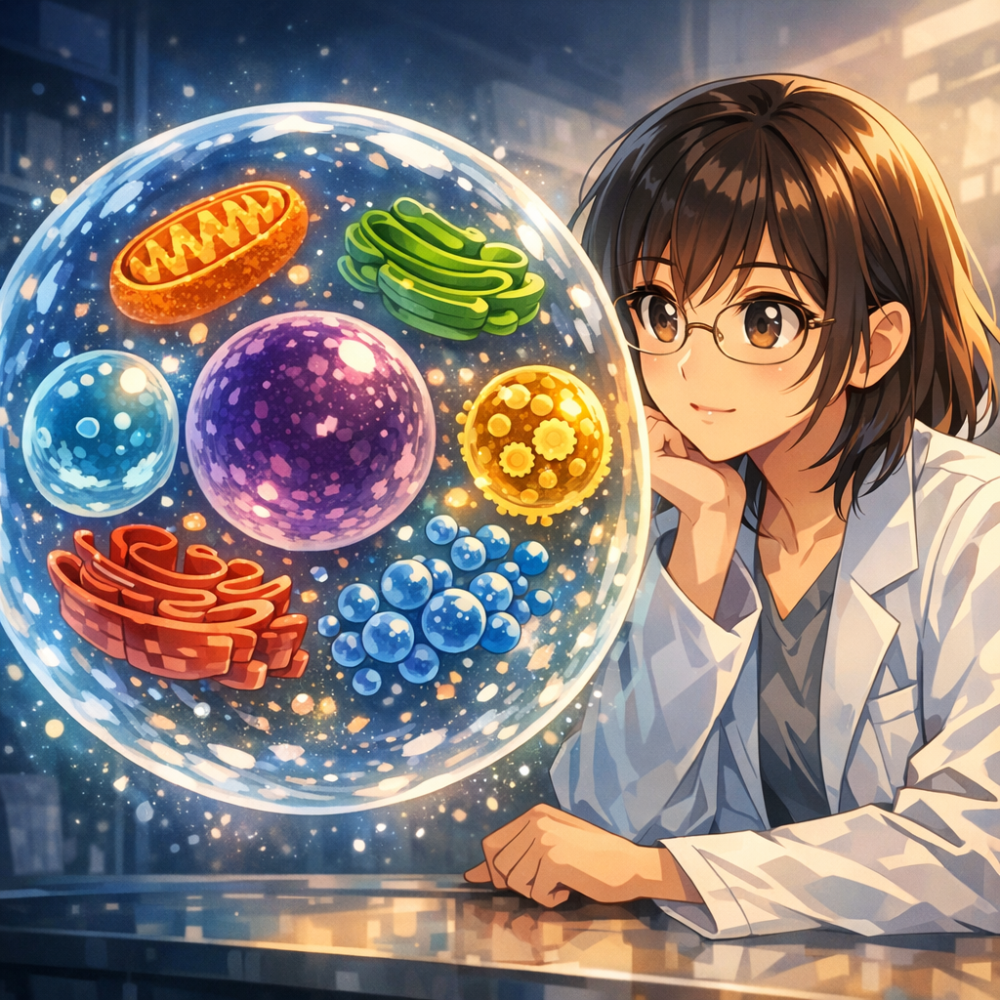

パラメータの物語

「生きた生物細胞を想像してみなさい」と指導教員は言った。「コードは細胞核のようなものだが、核だけでは活動できない。細胞膜やミトコンドリア、さまざまな細胞小器官が必要で――それらが一緒になって初めて、生存し繁殖できる生命を形作る。実験はまさにそんな細胞なんだ」みなみははっと悟った。自分は以前、いろいろな細胞小器官をただ無造作に積み上げていただけで、だから何も動かなかったのだ。

---

[← 前のページ](03.md) &nbsp;&nbsp;&nbsp; [次のページ →](05.md)

