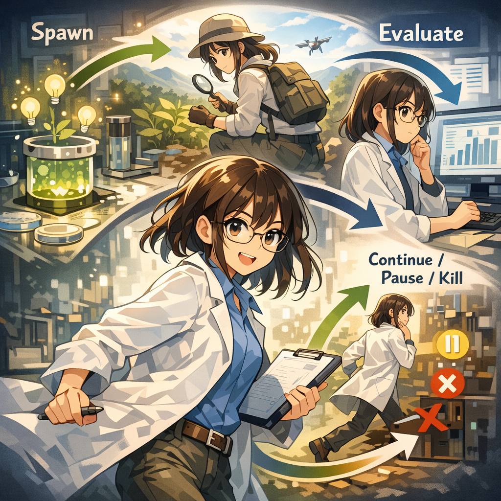

最適解のマージ

「失敗したブランチを削除してはいけない。」と指導教員は言った。みなみはexperiment-Aとexperiment-Bを残した。これらのブランチは彼女の探索の歴史であり、失敗と学びの証明だった。将来、なぜAやBを選ばなかったのかを振り返る必要が出たとき、これらのブランチは生きた証拠になる。そして、いつか新しいアイデアが生まれ、AやBの一部を使う必要が出てくるかもしれない。

---

[← 前のページ](16.md) &nbsp;&nbsp;&nbsp; [次のページ →](18.md)

