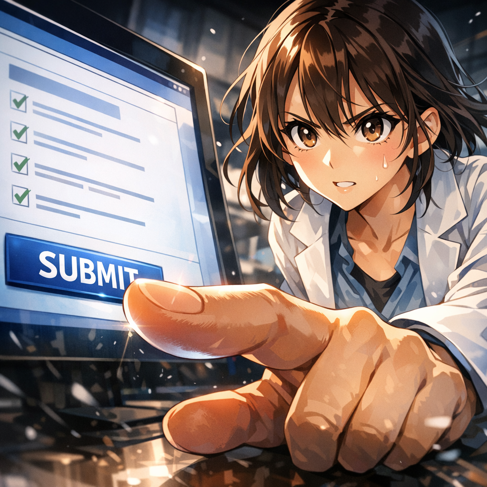

口頭試問当日がやってきた

1年後の口頭試問当日。みなみは教室のドアの前に立ち、深く息を吸い込んだ。彼女はあの絶望の夜を思い出す――72時間のデッドライン、3匹の怪獣、命綱となったあの一冊の本。そして今、彼女の目の前にいるのは、この分野で最も厳格な口頭試問委員会だ。彼女は発表原稿を握りしめ、ドアを押し開けた。この1年の努力が、今日、証明される。

---

[← 目次に戻る](../README.md) &nbsp;&nbsp;&nbsp; [次のページ →](02.md)

